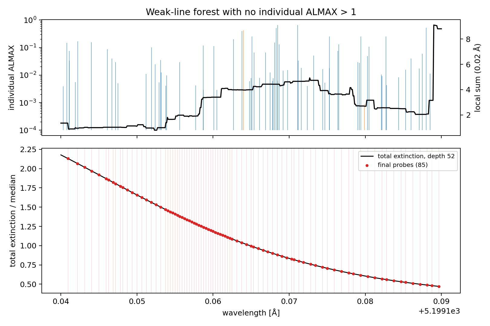

# ALMAX-seeded transfer-grid prototype

## 1. Problem

This study concerns the SMElib internal transfer wavelength grid, not the
adaptive continuum-opacity cache.  The legacy grid is accurate enough for its
historical purpose but becomes pathological for cool molecular spectra because
individual retained lines create transfer points before the interpolation
refinement begins.

No production default or public API was changed.  The prototype consists of a
diagnostic batch opacity/source evaluator and an offline bounded-grid sweep.
The legacy grid remains intact.

## 2. Legacy adaptive-grid audit

The plane-parallel generator is `RKINTS` in
`smelib/src/sme/sme_synth_faster.cpp`:

- It starts at `WFIRST` and walks the retained line list.
- For every retained line centre separated from the previous accepted point by
  more than `DVEL_MIN`, it inserts the line centre and one preceding midpoint
  (`sme_synth_faster.cpp:8527-8575`).
- `DVEL_MIN=3e4 cm/s=0.3 km/s`; this is the minimum spacing
  (`sme_synth_faster.cpp:8404`).
- The line-centre intensity is evaluated and a line with disk-centre depression
  below `EPS2` is marked weak (`sme_synth_faster.cpp:8571`).
- It subsequently inserts interval midpoints.  The error statistic is

  ```text
  |I(mid) - 0.5 [I(left)+I(right)]|
  + 0.005 |I(left)-I(right)|
  ---------------------------------
             I_continuum
  ```

  and the interval is accepted when this is below `EPS2=accwi`, or the minimum
  spacing is reached (`sme_synth_faster.cpp:8598-8637`).
- The default `accwi` is `3e-3` (`src/pysme/sme.py:261-263`).  It is a local
  disk-centre intensity interpolation test, not a global normalized-spectrum
  error bound.
- The wavelength output array size (`NWSIZE`, normally 40,000 from the Python
  wrapper) is the only effective global point cap.  There is no independent
  point budget or maximum refinement depth.  Reaching the array cap returns an
  error.
- Spherical models use the analogous `RKINTS_sph`.  LTE, NLTE, normal lines,
  hydrogen special profiles, and autoionization share the outer grid-generation
  logic; their opacity/source details branch inside `OPMTRX` and the profile
  routines.  Therefore a new estimator must cover both extinction and source
  numerator, and H/autoionization still require dedicated validation.

### Cool-star point attribution

The pathological model is 4250 K, log(g)=4.5, [M/H]=+0.3, vmic=1 km/s.  The
output interval is 5195--5205 A; SMElib's padded transfer interval is
5192.480--5207.521 A.  The input list contains 378,154 lines.

The raw legacy grid contains 10,049 points and takes 114.23 s inside `Transf`
(116.5 s in the complete PySME call).  Its minimum spacing is 0.00130 A.

| source | accepted line centres | initial grid points |
|---|---:|---:|
| atomic | 83 | 166 |
| molecular | 2,429 | 4,858 |
| total | 2,512 | 5,024 |
| later interpolation refinement | -- | 5,023 |

Thus 96.7% of line-centre triggers are molecular.  The ALMAX attribution is:

| ALMAX range | lines triggering centres | molecular | initial points |
|---|---:|---:|---:|
| `<1e-6` | 0 | 0 | 0 |
| `1e-6--1e-5` | 0 | 0 | 0 |
| `1e-5--1e-4` | 0 | 0 | 0 |
| `1e-4--1e-3` | 24 | 0 | 48 |
| `1e-3--1e-2` | 622 | 609 | 1,244 |
| `>=1e-2` | 1,866 | 1,820 | 3,732 |

The explosion is therefore caused mainly by a dense TiO forest, but not by the
`ALMAX<1e-4` tail.  The legacy minimum-spacing rule already merges many of the
20,161 retained lines in the padded interval down to 2,512 line-centre
triggers; each trigger is nevertheless expensive because it performs a full
opacity/source and transfer evaluation during dynamic construction.

## 3. Reference solution and fixed-grid convergence

The reference is a 0.0003125 A fixed transfer grid with 32,001 points.  A
0.000625 A grid differs from it by at most `6.54e-5` in the cool-star intrinsic
normalized spectrum, so the reference is sufficiently converged for the tested
tolerances.

The legacy grid is not the truth solution.  Interpolated to the reference grid,
it differs by:

| comparison | max abs delta F | RMS delta F |
|---|---:|---:|
| legacy intrinsic | `8.62e-4` | `5.92e-5` |
| legacy after R=20,000 | `2.71e-5` | `3.44e-6` |
| legacy after R=60,000 | `6.20e-5` | `1.13e-5` |

Cool-star fixed-grid convergence is:

| spacing | points | max intrinsic delta F | RMS | R=60k max delta F |
|---:|---:|---:|---:|---:|
| 0.05 A | 201 | `1.90e-1` | `3.82e-2` | `5.81e-2` |
| 0.02 A | 501 | `5.68e-2` | `8.13e-3` | `5.30e-3` |
| 0.01 A | 1,001 | `1.64e-2` | `2.18e-3` | `1.36e-3` |
| 0.005 A | 2,001 | `4.07e-3` | `5.54e-4` | `3.40e-4` |
| 0.0025 A | 4,001 | `1.04e-3` | `1.39e-4` | `8.41e-5` |
| 0.00125 A | 8,001 | `2.61e-4` | `3.47e-5` | `2.00e-5` |
| 0.000625 A | 16,001 | `6.54e-5` | `8.44e-6` | `4.00e-6` |

These intrinsic numbers compare the reconstructed high-resolution spectrum,
not only the original 201 output samples.  The previously measured direct
201-point fixed/legacy output difference (`max=0.0623`, `RMS=0.0196`) remains
valid but is not a convergence test.

## 4. ALMAX importance field

The prototype bins line centres in fixed local wavelength windows and computes
the sum of ALMAX in each bin.  A bin exceeding the importance budget receives
one seed, either at its centre or at the ALMAX-weighted centroid.  Independently,
lines above a strong-line threshold can force a line-centre seed.

The tested local widths were 0.02, 0.05, and 0.10 A.  The tested budgets were
`1e-2`, `3e-3`, `1e-3`, and `3e-4`.

## 5. Seed-grid result

In the cool molecular interval all four requested budgets saturate: essentially
every occupied local bin exceeds even `1e-2`.  Consequently the four budgets
produce identical grids.  This is a useful negative result: raw local summed
ALMAX is a valid occupancy/importance flag, but these absolute budgets do not
rank dense TiO regions.

At `tol=1e-3`, final point counts are approximately 7,800--8,000 for all tested
base spacings and windows.  The 0.05--0.10 A local window is marginally better
than 0.02 A.  A weighted centroid has no measurable accuracy advantage over a
bin centre.

## 6. Interpolation-error refinement

The diagnostic SMElib batch API evaluates, at each reference wavelength and
all 55 atmosphere depths:

```text
chi_total
eta_total = chi_total * source_total
```

For each probe, linear endpoint predictions are compared with exact values.
The relative denominator is floored at `1e-8` of the largest absolute value at
that wavelength, avoiding meaningless outer-layer division by nearly zero.
The interval error is the maximum of the extinction and source-numerator errors.

The implementation records a minimum spacing, maximum point count (20,000),
maximum depth (16), unresolved interval count, and worst unresolved error.  It
does not silently accept unresolved intervals.  `tol=1e-4` hits the prototype
point cap for all four models, showing that this tolerance is too strict for
the present metric/reference spacing.

## 7. Narrow-line safeguard

Three strategies were tested:

1. midpoint only;
2. midpoint plus the strongest line centre in the interval;
3. midpoint plus all line centres with ALMAX >= 10.

The strongest-line strategy is consistently the best simple safeguard.  In the
cool model at `tol=3e-4`, it reduces max intrinsic error from about `2.77e-4`
to `2.62e-4` with slightly fewer points.  Adding all ALMAX>=10 centres gives no
benefit over midpoint-only once those lines are already included by Stage 1.

## 8. Benchmark setup

- Machine: Apple M5, macOS arm64, Python 3.11.
- Window: 5195--5205 A.
- Output grid: 0.05 A, 201 points.
- Fine reference: 0.0003125 A, 32,001 points.
- Models: solar dwarf, metal-poor dwarf, cool metal-rich dwarf, and giant.
- `accrt=1e-4`, `accwi=3e-3` for the legacy comparison.
- 378,154 input lines from `merged_3700-9500_hfs.lin` with approximately
  +/-150 A line-list padding.
- Intrinsic spectra, continuum, feature EWs, and Gaussian-convolved R=20,000
  and R=60,000 spectra are stored in the NPZ result.

## 9. Main cool-star Pareto results

| method | points | measured transfer time | max intrinsic delta F | RMS | R=60k max delta F |
|---|---:|---:|---:|---:|---:|
| legacy adaptive | 10,049 raw / 6,662 in output interval | 114.23 s | `8.62e-4` | `5.92e-5` | `6.20e-5` |
| fixed 0.05 A | 201 | about 3.0 s complete | `1.90e-1` | `3.82e-2` | `5.81e-2` |
| fixed 0.02 A | 501 | about 3.1 s complete | `5.68e-2` | `8.13e-3` | `5.30e-3` |
| fixed 0.01 A | 1,001 | about 3.3 s complete | `1.64e-2` | `2.18e-3` | `1.36e-3` |
| fixed 0.00125 A | 8,001 | about 5.6 s complete | `2.61e-4` | `3.47e-5` | `2.00e-5` |
| hybrid, tol=1e-3 | about 7,800 | not separately verified | `7.53e-4` | `4.7e-5` | `6.7e-5` |
| hybrid, tol=3e-4 | 14,276 | 6.1--7.0 s fixed final pass | `2.62e-4` verified | `1.41e-5` | `2.08e-5` |
| fixed 0.000625 A | 16,001 | about 8.8 s complete | `6.54e-5` | `8.44e-6` | `4.00e-6` |
| fixed 0.0003125 A reference | 32,001 | 11.85 s `Transf` | -- | -- | -- |

The hybrid grid logic itself takes about 0.34 s when exact opacity/source
vectors are cached.  The diagnostic exact batch evaluated all 32,001 reference
points in 10.3 s; a production implementation would evaluate only requested
probes and reuse their transfer results.  Therefore 6.1--7.0 s is the final fixed
pass, not a fully integrated production hybrid wall time.

## 10. Other models

For the most useful common tolerance (`3e-4`), the best configurations give
(the selected irregular candidates were also verified by direct `Transf` runs):

| model | final points | max intrinsic delta F | RMS | R=60k max delta F | max feature EW delta [A] |
|---|---:|---:|---:|---:|---:|
| solar | 13,344 | `5.82e-4` | `1.36e-5` | `3.60e-5` | `2.69e-7` |
| metal-poor | 15,286 | `1.19e-4` | `5.79e-6` | `1.85e-5` | `1.45e-6` |
| cool metal-rich | 14,276 | `2.62e-4` | `1.40e-5` | `2.08e-5` | `1.71e-6` |
| giant | 14,107 | `4.05e-4` | `1.64e-5` | `3.03e-5` | `9.58e-7` |

The same opacity/source tolerance does not impose the same flux maximum across
models.  It controls the overall error scale, but it is not a strict final-flux
bound.

## 11. Weak-line collective-effect diagnostic

The interval 5199.14--5199.19 A contains 72 retained lines.  No individual line
has ALMAX above 1; the maximum is 0.662, the median is 0.0294, and their summed
ALMAX is 6.85.  Thus none is a forced `strong_threshold=1` line-centre seed.

The final `tol=3e-4` candidate nevertheless contains 85 probes in this 0.05 A
interval, with median spacing 0.000625 A.  These points are generated by total
extinction/source refinement, demonstrating that collective weak-line
blanketing is retained even when individual lines do not seed the grid.



## 12. Intrinsic, EW, and observable accuracy

For the cool `tol=3e-4` candidate:

- simulated intrinsic max/RMS: `2.62e-4 / 1.40e-5`;
- R=60,000 max/RMS: `2.08e-5 / 4.49e-6`;
- R=20,000 errors are smaller;
- the largest tested feature EW change is `1.71e-6 A`.

The observable/convolved accuracy is therefore excellent even where the
intrinsic core residual is a few `1e-4`.

## 13. Irregular-grid verification and corrected flux integration

The initially reported `8.06e-4` common-node discrepancy was a benchmark
post-processing artifact, not an SMElib grid dependence.  The benchmark had
passed the irregular `sint` and `cint` arrays directly to `integrate_flux`.
That routine performs at least 2x cubic-spline oversampling in array-index
space, which assumes regular wavelength/velocity spacing and therefore makes
its result depend on the neighbouring irregular nodes.

Direct comparison of the real fixed-grid runs gives bitwise-identical `sint`
and `cint` at every shared wavelength and mu angle.  Pure projected-area disk
integration is also bitwise identical at the common nodes.  After correcting
the benchmark to use that intrinsic integration, the 14,276-point candidate
has:

- common-node maximum difference: exactly `0`;
- interpolation prediction versus real candidate reconstruction: exactly `0`;
- full-grid intrinsic max/RMS difference: `2.619e-4` / `1.405e-5`;
- post-convolution maximum: `9.86e-6` at R=20,000 and `2.075e-5` at R=60,000.

Production PySME now resamples every mu intensity, including the continuum,
onto the common regular log-wavelength grid before calling `integrate_flux`.

## 14. Parameter sensitivity

- Importance budgets `1e-2` through `3e-4` are indistinguishable in the cool
  TiO forest because every local bin is above threshold.
- A 0.05--0.10 A importance window is marginally preferable to 0.02 A.
- Bin centre and ALMAX centroid are effectively equivalent; use the centre if
  this design is revisited.
- `strong_line_threshold=1` is safer than 10 or 100, but refinement dominates
  the final point count.
- Midpoint plus strongest line centre is the best tested narrow-line safeguard.
- Increasing the base density is not monotonically better because probe
  locations change; this is another sign that the current error estimator is
  not by itself a global spectrum guarantee.

## 15. NLTE, H-line, and autoionization extensibility

The prototype stores and tests both `chi_total` and
`eta_total=chi_total*S_total`, so the estimator can represent NLTE extinction
and emissivity.  NLTE has not yet been benchmarked, and production code must
ensure that departure-coefficient-dependent emissivity is evaluated at every
probe.

Hydrogen special profiles and autoionization already enter `OPMTRX`, so they
would be present in exact probes.  They still require dedicated windows and
line-centre/edge safeguards because midpoint tests can miss asymmetric or very
broad special-profile structure.

## 16. Recommended production architecture

The tested hybrid should not replace the legacy default yet.  The preferable
next prototype is a deterministic uniform log-wavelength/velocity transfer
grid:

1. derive or explicitly specify a velocity step;
2. run the existing fast fixed-grid interval sweep;
3. perform disk integration and convolution on that regular grid;
4. interpolate to the user output wavelengths;
5. retain legacy adaptive mode as a reference/compatibility option.

For this 10 A case, 0.00125 A (about 0.072 km/s at 5200 A) uses only 8,001
points and matches the 14,276-point hybrid's intrinsic and convolved accuracy.
A 0.000625 A grid gives `6.5e-5` intrinsic maximum error in 8.8 s complete wall
time.  A production velocity step should ultimately be tied to selected-line
Doppler widths and requested broadening, with chunking for wide intervals.

## 17. Go / no-go conclusion

**REVISE / no-go for production replacement in its current form.**

The hybrid succeeds at the scientific safety tests:

- it preserves all selected lines in opacity/source calculations;
- collective weak-line blanketing triggers refinement;
- it bounds point count and reports unresolved intervals;
- it reduces the cool legacy transfer pass from 114 s to approximately 6--7 s;
- convolved-spectrum and EW errors are very small.

However, it fails the Pareto requirement:

- the requested importance budgets saturate and add little information;
- at comparable accuracy, a regular 0.00125 A grid uses 8,001 points versus
  about 14,300 for the hybrid;
- the opacity/source tolerance is not a strict flux-error bound.

The main result is therefore not that adaptive sampling is impossible, but
that **local summed ALMAX plus recursive opacity/source refinement does not beat
a well-chosen fine regular velocity grid for this workload**.

## 18. Direct answers

1. The 116 s explosion comes from 2,512 retained line centres creating 5,024
   initial points, followed by 5,023 refinement points; each is evaluated during
   dynamic construction.
2. `ALMAX>=1e-2` contributes the most initial points (3,732), followed by
   `1e-3--1e-2` (1,244).
3. Local summed ALMAX detects occupied/blanketed regions, but the tested
   absolute budgets saturate in the TiO forest.
4. 0.05--0.10 A is better than 0.02 A, with no decisive difference between
   0.05 and 0.10 A.
5. No tested budget is preferred in the cool case; all four are equivalent.
6. A coarse 0.05 A base can work only with extensive refinement.  A regular
   final spacing around 0.00125 A is the better current solution.
7. The interpolation tolerance controls the general error scale but does not
   strictly bound final flux error across models.
8. Weak-line collective blanketing is retained; the 5199.14--5199.19 A test is
   a direct example.
9. The useful hybrid candidate needs about 14,300 transfer points in 10 A.
10. Its final fixed transfer pass is about 16--19 times faster than legacy,
    before accounting for a production grid-construction pass.
11. Verified intrinsic max/RMS errors are `2.62e-4/1.41e-5`; R=60k maximum is
    `2.08e-5`; EWs differ by at most `1.71e-6 A` in the cool case.
12. It is not yet worth replacing legacy adaptive with this hybrid.  A regular
    velocity-grid production path should be prototyped next.

## 19. Artifacts

- `analysis/almax_seeded_transfer_grid_benchmark.py`
- `analysis/almax_seeded_transfer_grid_benchmark.json`
- `analysis/almax_seeded_transfer_grid_benchmark.npz`
- `analysis/almax_seeded_transfer_grid_weak_forest.png`
