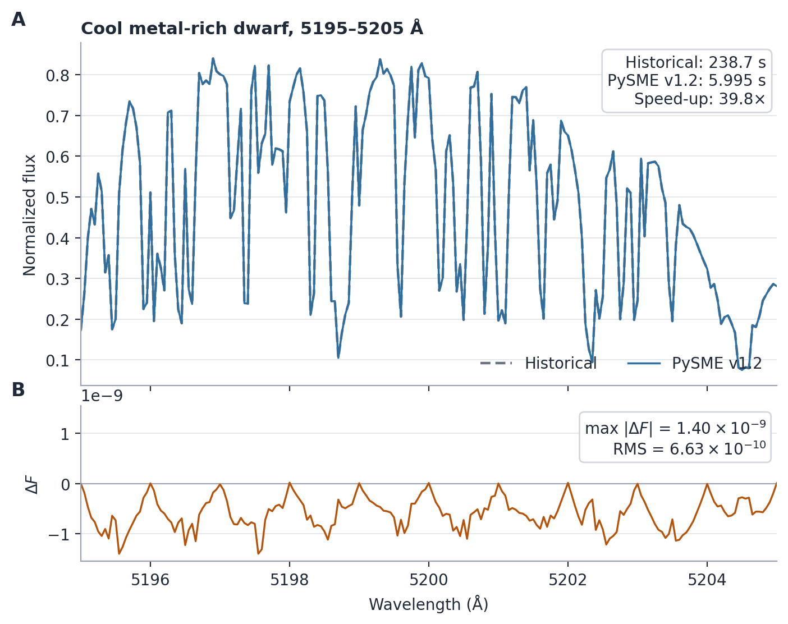

# Synthesis performance and numerical controls

## Why line handling matters

Spectral synthesis can involve very large line lists, ranging from thousands
to more than a million atomic and molecular transitions. The computational
cost therefore depends not only on the number of wavelength points, but also
on how many spectral lines need to be considered at each point.

In practice, most lines in a large input list do not need to be treated
everywhere. Some are too weak to affect the spectrum for a given stellar
atmosphere, while others contribute only within a limited wavelength range
around their line centres. Efficient synthesis therefore requires PySME to
determine both **which lines matter** and **where they matter** before
performing the radiative-transfer calculation.

## How PySME handles spectral lines

PySME separates the treatment of spectral lines into three related decisions:

```text
ALMAX or CDR line selection  -> whether a line is included in the synthesis
accrt + physical line range  -> over which wavelengths an included line contributes
accwi                        -> where the adaptive transfer grid is refined
```

Line selection first removes transitions whose contribution is negligible for
the current atmosphere. For each retained line, PySME then determines the
wavelength interval over which its opacity can matter. Finally, the adaptive
transfer grid determines where the radiative-transfer equation needs to be
evaluated accurately enough to represent the resulting spectrum.

These steps reduce different parts of the computational cost. Line selection
reduces the total number of lines, the physical line ranges reduce how many
lines need to be considered at each wavelength, and the adaptive grid controls
how many wavelength points require radiative-transfer calculations.

## What happens by default?

For normal synthesis and fitting, PySME chooses the appropriate synthesis
strategy automatically. If no internal transfer grid is supplied, PySME
normally constructs an adaptive wavelength grid and uses the optimized v1.2
implementation. If a fixed transfer grid is supplied explicitly, PySME uses
an optimized fixed-grid calculation instead.

In most cases, users do not need to choose between these paths. Legacy and
internal-selection modes remain available for compatibility and specialized
workflows; see {ref}`Compatibility controls <compatibility-controls>`.

### `wave` is not `wint`

`sme.wave` specifies where the final spectrum is returned. `sme.wint`
specifies where the native radiative-transfer calculation is performed.

Supplying `sme.wave` alone does not turn transfer into a fixed-grid
calculation. PySME normally computes on its internal adaptive transfer grid,
performs disk integration and broadening on a regular velocity grid, and then
interpolates the result to `sme.wave`.

Set `sme.wint` only when the native transfer calculation itself must use a
specific wavelength grid.

## How the optimized synthesis works

At a high level, synthesis follows:

```text
line selection
-> physical wavelength support
-> adaptive continuum-opacity cache
-> adaptive transfer wavelengths
-> sparse line evaluation
-> radiative transfer
-> disk integration and broadening
```

In PySME v1.2, the selected lines and their physical wavelength ranges are
determined before transfer and then reused throughout the synthesis. This
allows PySME to skip lines that cannot contribute at a given wavelength instead
of repeatedly checking the full line list.

### Adaptive continuum-opacity cache

The default `sme.continuum_grid = "adaptive"` evaluates continuum opacity on
a coarse base grid, includes known opacity edges, and refines locally where
interpolation is insufficient. Repeated exact continuum calculations are then
replaced by interpolation of the cached opacity components.

The public controls are:

- `sme.continuum_grid = "adaptive"` (default);
- `sme.continuum_grid = "exact"` for exact reference calculations;
- a positive number, such as `0.5`, for a fixed edge-aware diagnostic spacing;
- `sme.continuum_grid_base_step = 1.0` Å;
- `sme.continuum_grid_rtol = 1e-3`;
- `sme.continuum_grid_min_step = 1e-3` Å.

The cache is automatically invalidated when the atmospheric or chemical state
changes.

### Adaptive transfer and sparse line evaluation

PySME still uses an adaptive internal transfer grid. Adaptive wavelength
points are evaluated in groups, allowing the precomputed physical support of
each spectral line to be used efficiently. At a given wavelength, only lines
whose support overlaps that wavelength need to be evaluated.

The selected-line mask and physical line ranges remain fixed throughout the
optimized transfer calculation. `accwi` continues to control where the
adaptive transfer grid is refined.

(numerical-behavior-and-validation)=
## Numerical behavior and validation

Generation batching does not introduce an additional spectral approximation:
with the same line selection, physical ranges, continuum treatment, and
transfer grid, the validated results are identical.



*Representative 5195–5205 Å comparison for a cool metal-rich dwarf. Complete
synthesis time decreases from 238.7 s to 5.995 s (39.8×), while the maximum
normalized-flux difference is (1.40\times10^{-9}). The lower panel shows
(F_{\mathrm{v1.2}}-F_{\mathrm{historical}}).*

The adaptive continuum cache does introduce a small interpolation difference.
Its direct-synthesis normalized-flux effect was at most about `1.4e-9` in the
release validation matrix. A separate cumulative-bin CDR audit reached about
`7.24e-6` when a tiny numerical difference changed which weak line crossed a
selection boundary.

PySME v1.2 also corrects historical behaviors that are independent of the
performance approximation: order-dependent second weak-line rejection,
mutation of precomputed line ranges during transfer, irregular-grid flux
integration, and spherical ray ordering. These are intentional correctness
changes. In tests where the spectral difference was largest, the v1.2 result
was closer to a minimally pruned reference calculation.

## Numerical controls

### ALMAX and CDR

`sme.line_select_method` determines which lines are retained:

- `"almax"` (default) uses line-centre opacity ratios;
- `"cdr"` uses central-depth information and cumulative wavelength bins;
- `"internal"` uses the established SMElib internal path.

See [Line-selection reference](line_selection_reference.md) for threshold
coupling and advanced overrides.

### `accrt`

`accrt` is the local line-to-continuum opacity-ratio threshold used when
determining the physical wavelength support of an active line. It controls how
far line opacity is followed away from line centre and is not a direct bound
on final normalized-flux error. Under the default ALMAX configuration it also
provides the default line-strength threshold.

### `accwi`

`accwi` is the local adaptive-grid interpolation criterion based on emergent
intensity at the largest `mu`. It controls transfer-wavelength refinement and
is not a global bound on final flux error. It is ignored when a fixed
`sme.wint` is supplied.

(compatibility-controls)=
## Compatibility controls

For regression or historical comparisons, PySME retains controls for the
legacy transfer, internal line-selection, and exact-continuum paths:

```python
sme.transfer_grid_method = "legacy"
sme.line_select_method = "internal"
sme.continuum_grid = "exact"
```

These controls are independent; use only those needed for a particular
comparison. They reproduce selected historical synthesis components but do
not guarantee bitwise v1.1.x output, because unrelated correctness fixes
remain active.

### Detailed path-selection reference

| Configuration | Path used | Notes |
|---|---|---|
| No `sme.wint`; valid ALMAX/CDR mask and physical ranges; `transfer_grid_method="batched"` | Generation-batched adaptive transfer | Main optimized adaptive path for plane-parallel and spherical atmospheres |
| Explicit `sme.wint` | Sorted, interval-indexed fixed-grid transfer | Adaptive batching is unnecessary because the complete grid is already known |
| `line_select_method="internal"` with no `sme.wint` | Established internal/legacy adaptive transfer | Internal selection does not provide the precomputed state required by batching |
| `transfer_grid_method="legacy"` with no `sme.wint` | Sequential legacy adaptive transfer | Compatibility and reference path |

Line-list filtering is independent of the native transfer-grid optimization;
see [Line filtering](line_filtering.md).

## Further reading

- [Line-selection reference](line_selection_reference.md) documents all
  line-selection parameters and advanced overrides.
- [Flux and intensity](../fundamentals/flux_inten.md) explains transfer grids,
  disk integration, and returned wavelength grids.
- [Synthesis engine and performance architecture](../dev/synthesis_engine.md)
  describes the implementation and benchmark methodology.
