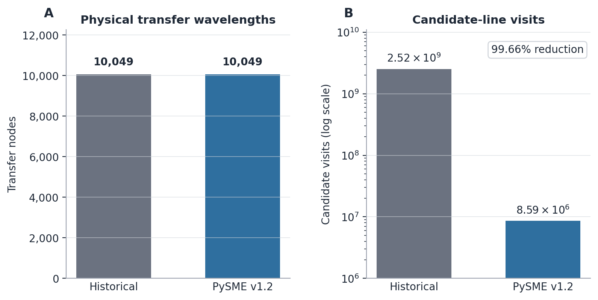

# Synthesis engine and performance architecture

This page describes the synthesis architecture introduced in PySME v1.2. It
is intended for developers and contributors who need to understand how line
selection, opacity construction, adaptive wavelength sampling, and radiative
transfer fit together.

The public Python API is documented elsewhere. Native classes, internal data
structures, and implementation details described here are not stability
guarantees.

## Architecture overview

For large line lists, synthesis cost is driven by two quantities:

1. how often expensive atmospheric and continuum quantities are recomputed;
2. how many spectral lines are examined at each transfer wavelength.

PySME v1.2 addresses these separately:

- an adaptive continuum-opacity cache avoids repeated exact continuum
  calculations;
- generation-batched adaptive transfer allows the precomputed wavelength
  support of each line to be used efficiently, so lines that cannot contribute
  at a given wavelength are not visited.

The high-level synthesis path is:

```text
atmosphere and EOS
-> line selection and physical line ranges
-> continuum-opacity cache
-> adaptive transfer-grid generations
-> interval-indexed line evaluation
-> radiative transfer
-> regular-velocity resampling
-> disk integration and broadening
```

Optional Python-side line-list filtering can reduce the line list before it is
installed in SMElib. This is independent of the native interval index used
later during transfer.

## Selection, support, and sampling

The optimized synthesis path separates three decisions that were historically
more tightly coupled:

```text
ALMAX/CDR selection          -> which lines are retained
accrt + physical Wlim        -> where each retained line can contribute
accwi                        -> where the transfer grid is refined
```

The selected-line mask and physical wavelength ranges are prepared before
transfer and remain unchanged throughout the optimized calculation.

This separation is important for both performance and reproducibility.
Transfer-grid refinement changes where the spectrum is sampled; it does not
change which lines exist in the calculation or overwrite their precomputed
physical support.

The optimized path therefore does not reproduce two historical RKINTS
behaviours:

- sequential `MARK=2` weak-line rejection during transfer;
- modification of precomputed `Wlim_left/right` values while constructing the
  wavelength grid.

Legacy transfer remains available for compatibility and regression work.

## Adaptive continuum-opacity cache

Continuum opacity depends on wavelength, atmospheric depth, and the loaded
atmospheric/chemical state, but varies much more smoothly with wavelength than
individual spectral lines.

PySME therefore evaluates the continuum on a reusable wavelength grid rather
than recomputing it independently for every line centre and transfer
wavelength.

The adaptive cache:

- starts from a nominal coarse wavelength grid;
- includes known physical opacity thresholds and opacity-table knots;
- uses exact guard regions around sharp edges;
- adds local refinement where interpolation tests fail;
- stores the continuum-opacity components required to reconstruct absorption,
  scattering, and total extinction.

The cache is invalidated when the physical state affecting continuum opacity
changes, including:

- atmosphere/model or geometry changes;
- abundance changes;
- EOS/ionization recomputation;
- continuum-grid configuration changes.

A line-list-only update does not directly invalidate continuum opacity because
transition data do not enter `CONTOP`; subsequent ionization can still
invalidate the cache if the chemical state changes.

`continuum_grid="exact"` bypasses interpolation and remains the reference
mode. Numeric fixed spacings are available primarily for diagnostics and
controlled comparisons.

## Generation-batched adaptive transfer

Legacy RKINTS constructs the adaptive wavelength grid sequentially:

```text
generate one wavelength
-> evaluate opacity and transfer
-> decide whether another wavelength is needed
-> repeat
```

This produces correct adaptive sampling, but each newly generated wavelength
arrives in isolation. The opacity calculation therefore cannot efficiently
exploit the known wavelength ranges of the full line list.

The v1.2 scheduler preserves the adaptive-grid criterion but changes the
execution order:

1. construct the initial endpoint and line-centre seed grid;
2. evaluate the complete sorted generation;
3. identify intervals requiring refinement;
4. collect and sort all new midpoint probes;
5. evaluate the next generation as a batch;
6. repeat until the `accwi` criterion or minimum-spacing limit is satisfied.

Previously evaluated endpoints are cached and are not recomputed.

The key gain is not a reduction in the number of physical transfer
wavelengths. Instead, each sorted generation can be combined with the
precomputed line ranges.

`LineIntervalSweep` tracks which line-support intervals overlap each
wavelength in a sorted generation. `OPMTRXIndexed` therefore visits only
candidate lines whose `Wlim_left/right` includes the current wavelength,
instead of scanning the full active line list.

Candidate indices remain in original line-list order, so the opacity
accumulation order is unchanged.



*The v1.2 scheduler evaluates the same 10,049 physical transfer wavelengths as
the historical adaptive calculation in this line-rich test, but
interval-indexed lookup reduces candidate work from a 2.524-billion full-scan
equivalent to 8.588 million visits (99.66%).*

This is the dominant reason generation batching is faster. In the v1.2
release benchmarks:

- the number of physical transfer-wavelength evaluations was essentially
  unchanged;
- candidate-line visits were reduced by approximately 99.6–99.9% in line-rich
  cases;
- native adaptive transfer improved by roughly 24× in the representative
  line-rich plane-parallel case and by about 24–31× in the main spherical
  line-rich cases.

Some special-profile spherical benchmarks showed still larger transfer-only
gains. These numbers are workload-specific benchmarks, not performance
guarantees.

## Plane-parallel and spherical transfer

Plane-parallel and spherical atmospheres use the same:

- selected-line state;
- physical line ranges;
- continuum cache;
- adaptive generation scheduler;
- interval-indexed opacity construction.

Only the geometry-specific formal solution differs.

```text
shared scheduler
      |
      +-> OPMTRXIndexed -> TBINTG
      |
      +-> OPMTRXIndexed -> spherical ray mapping -> TBINTG_sph
```

For spherical atmospheres, the wavelength-independent ray geometry is prepared
once per transfer calculation. Each ray can have a different path length,
number of intersected layers, and grazing geometry, but all rays consume the
same radial opacity and source arrays.

Normal rays are evaluated before grazing rays, with grazing rays ordered from
deepest to shallowest penetration. This avoids contamination from the in-place
mirrored far-side arrays used by the spherical solver and makes the result
independent of the caller's `mu` ordering.

## Adaptive-grid refinement

The optimized scheduler retains the existing `accwi` refinement test based on
emergent disk-centre intensity.

Conceptually, an interval is refined when the actual midpoint intensity differs
sufficiently from the interpolation implied by the interval endpoints, subject
to the minimum wavelength/velocity spacing.

`accwi` is therefore a local sampling criterion. It is not a direct upper bound
on the final normalized-flux error.

Supplying an explicit native transfer grid (`sme.wint`) bypasses adaptive
refinement, so `accwi` does not control that calculation.

## Flux integration on adaptive grids

The native adaptive transfer grid, `wint`, is generally irregular.

Disk integration and velocity-space broadening are performed only after each
angle-dependent line and continuum intensity has been resampled onto a common
regular log-wavelength grid.

The sequence is therefore:

```text
native irregular wint
-> sint(mu, wavelength), cint(mu, wavelength)
-> common regular velocity/log-lambda grid
-> disk integration
-> rotational/macroturbulent broadening
-> requested output grid
```

This ordering is necessary because the broadening/integration machinery assumes
uniform velocity spacing.

When `specific_intensities_only=True`, PySME returns the native intensity grid
without the flux-level integration and broadening steps.

## Production path selection

The generation-batched adaptive scheduler is used when:

- the native transfer grid is adaptive;
- a validated precomputed line mask and physical ranges are available;
- the batched transfer method is selected;
- the required continuum mode is supported.

The same optimized adaptive scheduler is available for plane-parallel and
spherical atmospheres.

Other configurations retain their appropriate existing paths:

- an explicit `sme.wint` uses the sorted, interval-indexed fixed-grid path;
- `line_select_method="internal"` retains the established internal-selection
  path;
- explicit legacy transfer uses sequential `RKINTS`/`RKINTS_sph`;
- unsupported or invalid precomputed state falls back or raises according to
  the configured line-selection policy.

High-level synthesis normally prepares or refreshes the required ALMAX/CDR
state before transfer.

## Numerical validation

The two main performance optimizations have different numerical status.

Generation batching changes scheduling and candidate lookup only. Under
controlled conditions with identical:

- line selection;
- physical wavelength ranges;
- continuum treatment;
- adaptive refinement criterion;

the validated complete spectra are identical to the corresponding
sequential/fixed-node reference calculations.

Native `sint` and `cint` values were bitwise identical at common transfer nodes
in the tested:

- plane-parallel cases;
- spherical normal and grazing rays;
- hydrogen-profile cases;
- NLTE departure-coefficient cases.

The continuum cache uses interpolation and therefore introduces a small
numerical approximation. In the controlled v1.2 direct-synthesis validation
matrix, the maximum normalized-flux difference relative to exact-continuum
calculation was about `1.4e-9`.

A separate CDR selection test reached approximately `7.24e-6` when a tiny
numerical change altered the ordering of weak lines at a cumulative selection
boundary.

The large line-state caches are stored in single precision, while opacity
accumulation, profile evaluation, and radiative-transfer arithmetic remain
double precision. Across the validation set:

- the maximum normalized-flux difference was about `1.6e-8`;
- selected-line masks were unchanged;
- physical wavelength ranges were unchanged.

These storage changes reduce memory use without changing the underlying
physical algorithm.

## Memory architecture

### Line-state caches

The dominant native line-state arrays are:

```text
LINEOP[depth][line]
AVOIGT[depth][line]
VVOIGT[depth][line]
```

Their memory scales approximately as:

```text
3 * number_of_lines * number_of_depths * sizeof(float)
```

in v1.2.

For million-line lists this remains a substantial allocation, but storing
these caches as `float` approximately halves their line-state memory compared
with the previous double-precision representation.

### VALD parsing

Large supported VALD `long + extract_stellar` files are parsed incrementally
rather than by simultaneously retaining several complete text
representations. In the 1.26-million-line validation case, the parser peak RSS
was reduced by about 56%.

Very wide, line-rich single-segment synthesis can still require several GiB of
memory because the final line list, native line state, and adaptive transfer
arrays all scale with problem size.

### Adaptive transfer capacity

Historically, adaptive transfer used a fixed 400,000-node allocation.

In v1.2 this is no longer a hard ceiling. Ordinary calculations retain the
historical default allocation, while unusually wide or line-rich segments
receive a larger estimated capacity based on the available line-centre and
minimum-spacing bounds.

This changes storage capacity only; it does not change wavelength refinement
or radiative-transfer physics.

## Concurrency

SMElib still uses process-global mutable native state and is not
instance-reentrant. Creating multiple `SME_DLL` Python objects therefore does
not create independent native synthesis states.

High-level PySME synthesis and solve workflows protect complete native sessions
with a process-wide re-entrant lock. Threaded calls are therefore
correctness-safe through serialization, but they do not execute SMElib
synthesis concurrently.

For independent targets, process-based parallelism is the recommended route to
true parallel execution.

When using multiple processes, memory use should be considered explicitly for
very large line lists because each worker can require its own line-list and
native line-state storage.

Low-level transaction/session helpers remain implementation-facing and are not
documented as a general public parallelism interface.
